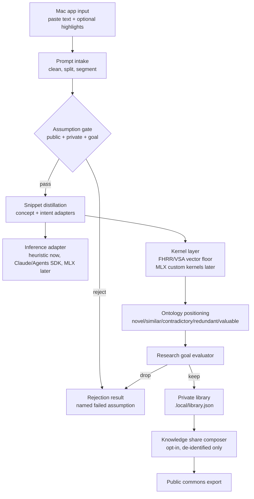

# App Architecture Node

This node is the app-side implementation plan for Humanitik / Humanitic Macro-Prompt Lab: a local Mac app where a builder pastes text, optionally marks the parts they believe carry "prompt magic", and receives a private library of reusable nano-snippets.

The research side can evolve separately. The app side must make the loop runnable end to end, keep the local-first promise, and expose clean adapter boundaries for agentic researchers.

## MVP Loop



## What Earns A Module

Only create a module when it has a different reason to change.

| Module | Current file | Why it earns a boundary |
| --- | --- | --- |
| Prompt intake | `src/core/intake.ts` | The Mac UI will add paste, files, selections, and highlight ranges while the rest of the loop stays stable. |
| Assumption gate | `src/assumptions/index.ts` | Public assumptions, private assumptions, and research-goal constraints will change as the lab learns. |
| Snippet adapters | `src/snippets/*.ts` | Concept-snippets and intent-snippets have different shapes, UI affordances, and extraction logic. |
| Inference adapter | `src/adapters/inference/*.ts` | Claude, Agents SDK, MLX LLM, and heuristic engines must be swappable without touching research modules. |
| Kernel/vector layer | `src/ontology/vector.ts` | The readable FHRR/VSA floor can later become MLX custom kernels without rewriting the app loop. |
| Ontology graph | `src/ontology/graph.ts` | Graph placement is long-term memory and will grow into a richer concept-intent-effect-risk ontology. |
| Goal evaluator | `src/evaluator/index.ts` | Users must be able to optimize for coding, alignment, interdisciplinary synthesis, safety, or another research goal. |
| Private library | `src/library/index.ts` | Storage will move from JSON to the Mac app's persistence layer, but ownership and local-first rules stay fixed. |
| Share composer | `src/share/index.ts` | Publication has separate privacy, governance, and attribution rules; raw prompts must never enter it. |
| CLI/app runner | `src/cli.ts` | Agents, tests, and the future Mac UI need one simple end-to-end entrypoint. |

## UI Shape For The Mac App

The first screen should be the working lab, not a landing page:

- Left: one large input editor for pasted text.
- Inline: optional highlights for user-identified "prompt magic"; store these as local annotations attached to fragment ids.
- Right top: segmented tabs for `Concepts`, `Intents`, `Ontology`, and `Rejected`.
- Right middle: concept-snippets as compact 2-3 word chips; intent-snippets as dense one-line rows with a reasoning-move label.
- Right bottom: research goal profile and assumption failures, visible enough that the user knows why something was kept or rejected.
- Footer/action rail: `Learn`, `Experiment`, `Contribute`. Contribution is disabled until a snippet is explicitly opted in.

Concept-snippets and intent-snippets should never be merged in the UI. They are different mental objects.

## End-To-End Working Version

The current CLI is the first app runner:

```bash
npm run demo
npm run learn -- --file prompt.txt
npm run experiment -- --text "Compare multiple interpretations before answering."
npm run contribute -- --id <snippet-id>
```

Default behavior is offline. `--engine claude` is opt-in and falls back to the heuristic adapter when the SDK or key is unavailable.

The future MLX path should be implemented as another `InferenceAdapter`, not as special-case logic in snippets, ontology, or evaluator modules.

## Semantic Limit Tests

Before a new feature earns its own module, test it against these limits:

1. Does it have a different reason to change from the existing module?
2. Does it protect a boundary users or researchers must understand, such as privacy, assumptions, ontology, or engine choice?
3. Does it let concept-snippets and intent-snippets remain mentally clean?
4. Does it preserve Article 0: raw pasted prompts are local and unpublishable?
5. Does it make `/learn`, `/experiment`, or `/contribute` easier to run or inspect?

If the answer is no, keep it inside the current module.

## Next Build Phases

1. CLI MVP: keep the TypeScript loop runnable and inspectable.
2. Mac UI shell: one editor, highlight annotations, snippet panes, local library.
3. MLX adapter: local SLM inference behind the existing `InferenceAdapter` contract.
4. Kernel upgrade: replace the readable vector floor with MLX-backed FHRR operations.
5. Ontology expansion: persist nodes and edges beyond snippet vectors: concept, intent, effect, risk, evidence, contradiction.
6. App Studio phase: expose assumption packs, goal profiles, and snippet adapters as user-configurable building blocks.
