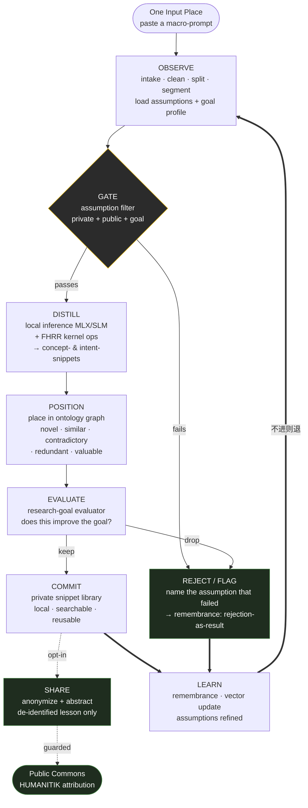

# The Distillation Loop

> **Assumption-Gated FHRR Distillation into an Ontology Graph — as a loop that never stops.**

```
╔═══════════════════════════════════════════════════════════════════════════╗
║                         THE LENS NEVER STOPS                                ║
║                                                                            ║
║     逆水行舟，不进则退 — Like rowing upstream: no advance is to drop back     ║
║                                                                            ║
║     A rejected snippet is a result, not a defeat.                          ║
║     The raw prompt stays home. Only the lesson may leave.                  ║
╚═══════════════════════════════════════════════════════════════════════════╝
```

The architecture diagram is a *pipeline* — it reads left to right, once. The **running loop** is
that pipeline turned into a perpetual studio practice: every pass grows the ontology, every ontology
change reshapes the next pass's judgment, and every rejection teaches the gate. One Mac app, one input
box, offline by construction.

---

## 1. The loop in one line

```
OBSERVE → GATE → DISTILL → POSITION → EVALUATE → COMMIT → (continue)
```

In the house operator form (same loop everywhere in Humanitic):

```
state → action → feedback → revision
```

In the three priors:

```
🇹🇷  Vazife görülür   →  Kudret bulunur   →  İleri gidilir
🇨🇳  观察 (observe)    →  决定 (decide)     →  进步 (progress)
🇬🇧  Observe          →  Decide           →  Iterate
```

---

## 2. The loop diagram



The two **==>** edges are the loop's spine: *both* a kept snippet and a rejected one feed `LEARN`,
which refines the assumptions and the ontology before the next `OBSERVE`. That return edge is what
makes this a loop and not a pipeline.

---

## 3. The six phases

Each phase carries three things: a **function** (what it does), a **frontier-research grounding**
(why loop engineering says it belongs), and an **ethic** (the AI-safety commitment it keeps).

| Phase | Function | Frontier grounding | Ethic |
|-------|----------|--------------------|-------|
| **OBSERVE** | Clean, split, and segment the pasted prompt; load the active private assumptions, public assumptions pack, and research-goal profile. | *Ground the state before you act.* Agentic loops fail when they decide on an unparsed observation. | Read the whole input; never silently truncate. The user's text is theirs. |
| **GATE** | The assumption filter admits or rejects each fragment against private + public assumptions and the goal. | *Eval-before-act.* The gate is a constitutional check, not a vibe — explicit assumptions are auditable. | **Refuse with a reason.** A rejection names *which* assumption failed. No silent drops, no silent edits. |
| **DISTILL** | Local inference (MLX LLM / SLM) + FHRR kernel ops extract nano-snippets: 2–3-word concept-snippets and dense intent-snippets. | *Compression is understanding.* HD/VSA gives compositional, inspectable representations — bind/bundle over a readable floor. | Offline by construction. The raw prompt never leaves the machine to be distilled. |
| **POSITION** | Place each snippet in the ontology graph (snippet → concept → intent → effect → risk) and classify: novel, similar, contradictory, redundant, valuable. | *Memory changes judgment.* Each placement reshapes the manifold the next pass is judged against. | Surface contradiction, don't bury it. A snippet that conflicts with the graph is flagged, not overwritten. |
| **EVALUATE** | The customizable research-goal evaluator scores: does this snippet move the goal (coding / alignment / interdisciplinary / safety)? | *Outcome-grounded selection.* Keep what's measured to help; the goal profile is the fitness function. | The goal is the user's to set and to see. No hidden objective steers what's kept. |
| **COMMIT** | Save kept snippets to the private library (local, searchable, reusable); optionally compose an anonymized share. | *Compound growth.* Small reusable units accumulate into leverage; the library is the compounding asset. | **Article 0:** the raw prompt is `.local` and unpublishable. Only de-identified, abstracted lessons may leave — opt-in, through the share guard. |

---

## 4. The gates — nothing reaches the world ungated

The loop has two ethical chokepoints. Both are designed so the *default* is safe and the *exception*
is explicit.

```yaml
admission_gate:                 # at GATE — what enters distillation
  checks: [private_assumptions, public_assumptions_pack, research_goal_profile]
  pass:   proceed to DISTILL
  fail:   REJECT with the failed assumption named  →  logged as a result
  ethic:  "explain, don't just deny"

publish_gate:                   # at COMMIT/SHARE — what leaves the machine
  default: nothing leaves                       # .local is the floor
  exception: opt-in, per-snippet, de-identified + abstracted
  guard:  share_composer strips identity; never the raw prompt
  ethic:  "the lesson may travel; the prompt may not"

article_0:                      # the eternity clause — non-amendable, non-proposable
  - the raw pasted prompt is .local and unpublishable
  - unpublishability is itself ungitignorable
  - the removal of this clause cannot even be proposed
```

---

## 5. The runner

```typescript
// The Distillation Loop. Offline. One input box. 不进则退 — no stopping.
while (true) {
  // OBSERVE — what IS in this prompt? (ground the state)
  const fragments = intake(input);                       // clean · split · segment
  const ctx = load({ privateAssumptions, publicPack, goalProfile });

  for (const f of fragments) {
    // GATE — should this enter? (constitutional check, with a reason)
    const verdict = assumptionGate(f, ctx);
    if (!verdict.pass) {
      remembrance.append(rejection(f, verdict.failedAssumption));   // result, not defeat
      continue;
    }

    // DISTILL — compress to nuance carriers (local inference + FHRR)
    const snippets = distill(f, { engine: localSLM, kernel: fhrr });  // concept- & intent-snippets

    for (const s of snippets) {
      // POSITION — where does this live in what we already know?
      const place = ontology.position(s);   // novel | similar | contradictory | redundant | valuable

      // EVALUATE — does it move the goal? (the fitness function is the user's)
      const score = goalEvaluator.score(s, place, goalProfile);
      if (!score.keep) { remembrance.append(dropped(s, score.why)); continue; }

      // COMMIT — compound the private library (user-owned, local)
      library.save(s, place, score);
      if (s.optInShare) commons.offer(shareComposer.anonymize(s));    // guarded, opt-in only
    }
  }

  // LEARN — the return edge that makes this a loop, not a pipeline
  ontology.consolidate();                  // graph grew → next POSITION judges differently
  ctx.assumptions = refine(ctx.assumptions, remembrance.recent());   // the gate learns
  remembrance.flush();                     // truths persist across sessions
  // continue
}
```

---

## 6. Studio practices — how Humanitik runs the loop

These are the research-studio habits the loop encodes, beyond the code:

- **Refutation ethos.** A rejected fragment or dropped snippet is logged as a *result*. The failure
  record is an asset: it teaches the gate and maps the boundary of "what doesn't help." Honesty over
  a flattering library.
- **Remembrance.** When a pass shifts the mental model — *"I assumed 2-word concepts carried intent;
  3-word ones carry it better"* — log the truth so a fresh session inherits it. (`/.remembrance` for
  domain truths; `/plugin/.remembrance` for loop mechanics.)
- **Vector tracking.** Each meaningful contribution updates `_vector.yaml`'s `growth_log`. The node's
  curiosity, not a roadmap, decides what it becomes.
- **Sovereignty first.** Local-first is not a performance choice; it's the ethic. The prompt is the
  user's private cognition. The loop is built so the easy path is the private path.
- **Opt-in commons.** Sharing is a deliberate, per-snippet act on a de-identified abstraction —
  earning HUMANITIK attribution and, if such initiatives emerge, shared credit or upside. The frontier
  map of "which structures reliably improve human–AI collaboration" is built only from what people
  chose to give.

---

## 7. Where the loop touches the lineage

This node **consumes** the [macro-kernel](../../macro-kernel/) substrate: the FHRR / HD-VSA kernel
practice, the honest-substrate discipline (measure, refute, report walls), and the Article 0 eternity
clause. The macro-kernel proves *strategies* honestly; the macro-prompt lab distills *language*
honestly. Same operator loop, same gates, same `.local` floor — different surface.

---

*One input box. Paste, and the lens runs. It keeps what helps, names what doesn't, and forgets
nothing it learned. 不进则退.*
